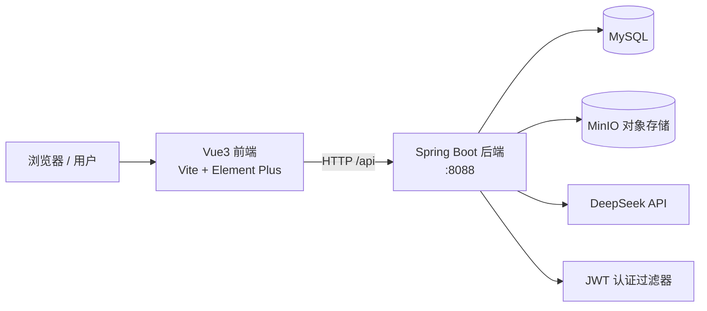
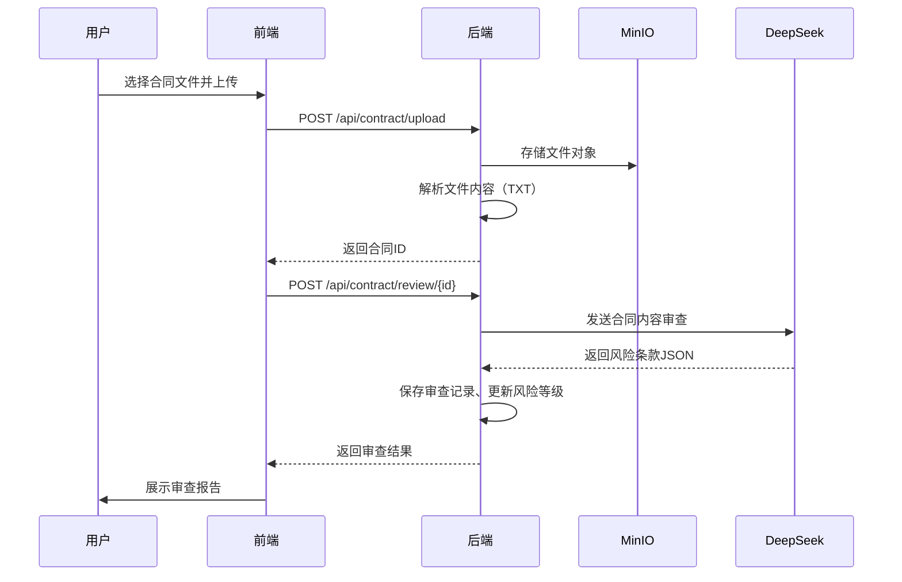

# 智能租房合同审查与租房全流程管理平台——项目说明

## 一、项目概述

本项目是一个面向租客的租房辅助管理平台，围绕"看房—签约—入住—缴费—维修—退租"的租房全流程提供数字化管理，并引入大语言模型（DeepSeek）提供合同智能审查与租房法律咨询能力。

系统采用前后端分离架构：

- 后端：Spring Boot 3 单体服务，提供 RESTful API、JWT 无状态认证、MinIO 对象存储、DeepSeek AI 接入；
- 前端：Vue 3 单页应用，Element Plus 组件库，通过 Vite 开发代理访问后端。

## 二、项目背景与意义

租房过程中，租客普遍面临合同条款不透明、押金纠纷、费用不清晰、维修责任划分不明等问题。传统租房管理依赖线下纸质文件和人工记忆，效率低且容易遗漏关键节点。

本项目尝试通过信息化手段解决上述痛点：

1. **合同智能审查**：上传合同后由 AI 按租金、押金、租期、维修、违约、退租等维度识别风险条款，并给出修改建议；
2. **全流程管理**：房源、看房、费用、报修、退租等环节统一线上化，形成完整记录；
3. **法律咨询助手**：基于 DeepSeek 的多轮对话，随时提供租房法律问题咨询。

## 三、技术栈

| 层次 | 技术 | 版本 |
| --- | --- | --- |
| 后端语言 | Java | 21 |
| 后端框架 | Spring Boot | 3.4.1 |
| ORM | MyBatis-Plus | 3.5.5 |
| 数据库 | MySQL | 8.x |
| 对象存储 | MinIO | 8.5.12 |
| 认证 | JWT（jjwt） | 0.12.6 |
| 接口文档 | Knife4j（OpenAPI3） | 4.5.0 |
| AI 服务 | DeepSeek API（模型 `deepseek-v4-flash`） | — |
| HTTP 客户端 | OkHttp | 4.12.0 |
| 前端框架 | Vue 3（组合式 API） | 3.5.x |
| 构建工具 | Vite | 8.x |
| UI 组件库 | Element Plus | 2.14.x |
| 状态管理 | Pinia | 4.x |
| HTTP 请求 | Axios | 1.x |

## 四、系统功能

### 4.1 用户模块

- 用户注册、登录（BCrypt 密码加密，JWT 签发）；
- 个人信息查看与修改（仅允许修改昵称、手机号）；
- 登录态校验与过期处理。

### 4.2 合同模块（核心）

- 合同文件上传（TXT/PDF/Word 解析）；
- 文件存储至 MinIO，生成唯一对象名；
- AI 合同审查：按 6 个维度识别风险条款，生成风险等级（高/中/低）、风险解读与修改建议；
- 审查记录管理：条款原文、风险类型、风险说明、修改建议；
- **审查报告导出 PDF**：一键下载包含合同信息与全部风险条款的审查报告；
- 合同列表、详情、删除（同步清理 MinIO 文件）。

### 4.3 AI 顾问模块

- 基于 DeepSeek 的多轮法律咨询对话；
- 会话历史保存，支持按会话 ID 续聊（最近 10 条上下文）；
- **历史会话管理**：会话列表（标题/消息数/时间）、查看并继续旧会话、新建对话、删除会话。

### 4.4 房源与看房模块

- 房源信息录入（地址、租金、押金、户型、面积、联系人等）；
- 房源状态管理（待出租/已签约/已取消）；
- 看房记录：时间、印象、优缺点、评分。

### 4.5 费用模块

- 水电燃气、物业、网络等费用记录；
- 账单月份、截止日期、缴费状态管理。

### 4.6 维修报备模块

- 维修问题提交（标题、描述、紧急程度、图片）；
- 状态流转：待处理 → 处理中 → 已完成。

### 4.7 退租模块

- 退租清单创建：退租日期、关联合同、押金总额、扣除金额、应退金额；
- 退租记录管理。

### 4.8 工作台

- 合同总数、待审查合同、高风险条款、本月费用等统计；
- 合同风险分布饼图、近 6 个月费用趋势柱状图（ECharts 可视化）；
- 最近合同与快捷入口。

### 4.9 工程化能力

- **合同文件预览/下载**：列表与审查页均可查看或下载原始合同文件（MinIO 读取，带归属校验）；
- **接口耗时日志**：AOP 切面统一记录接口执行耗时与异常；
- **后端分页**：合同/房源/费用/维修/退租列表统一后端分页，合同支持关键字搜索。

### 4.9 管理后台（管理员）

- **用户管理**：用户列表与搜索、启用/禁用账号、修改角色（user/admin）、重置密码（管理员不能操作自己的状态与角色，避免锁死）；
- **全局数据查看**：只读查看所有用户的合同、房源、费用、报修、退租记录，支持关键字搜索与分页；
- **数据统计**：用户数、合同总数、待审查合同、高风险合同、房源数、待处理报修、本月费用。

权限控制：管理接口统一通过 Spring Security 方法级权限 `@PreAuthorize("hasRole('ADMIN')")` 保护，JWT 中携带角色声明，非管理员访问返回 HTTP 403；前端侧边栏按角色显示"管理后台"菜单，路由守卫拦截非管理员访问。

## 五、系统架构

### 5.1 总体架构



### 5.2 后端分层

```text
controller（接口层）
    ↓
service / service.impl（业务层）
    ↓
mapper（MyBatis-Plus 数据访问层）
    ↓
MySQL
```

公共组件：`common`（统一返回 Result、全局异常处理、JWT 工具、安全上下文）、`config`（安全、MinIO、MyBatis-Plus、DeepSeek 配置）、`dto`（请求/响应对象）、`entity`（实体）。

### 5.3 认证流程

1. 用户登录成功后签发 JWT（有效期 24 小时）；
2. 前端将 token 放入 `Authorization: Bearer <token>`；
3. `JwtAuthenticationFilter` 校验 token 并将用户 ID 写入安全上下文；
4. 业务层通过 `SecurityUtil.getCurrentUserId()` 获取当前用户，统一做资源归属校验；
5. token 缺失或失效时返回 401，前端自动跳转登录页。

## 六、数据库设计

数据库名 `rental_platform`，建表脚本见 `rental-platform-backend/sql/schema.sql`，共 9 张表：

| 表名 | 说明 | 关键字段 |
| --- | --- | --- |
| `user` | 用户表 | username、password(BCrypt)、role、status |
| `contract` | 合同表 | user_id、file_path、content、status、risk_level |
| `review_record` | 审查记录表 | contract_id、clause_content、risk_level、suggestion |
| `house` | 房源表 | user_id、address、rent_price、status |
| `house_viewing` | 看房记录表 | house_id、viewing_time、score |
| `expense` | 费用记录表 | contract_id、expense_type、amount、is_paid |
| `repair_request` | 维修报备表 | title、description、urgency、status |
| `move_out_checklist` | 退租清单表 | contract_id、total_deposit、deduction_amount |
| `ai_conversation` | AI 对话记录表 | user_id、question、answer、conversation_id |

通用设计：`id` 自增主键；`created_at`/`updated_at` 自动填充；业务表使用 `deleted` 逻辑删除。

## 七、核心业务流程：合同智能审查



## 八、安全设计

1. **密钥管理**：数据库密码、DeepSeek API Key 通过环境变量注入（`DB_USERNAME`、`DB_PASSWORD`、`DEEPSEEK_API_KEY`），不写入代码仓库；
2. **认证**：JWT 无状态认证，BCrypt 密码加密存储；
3. **角色权限**：JWT 携带角色声明，管理接口使用方法级权限校验，普通用户访问返回 403；
4. **越权防护**：所有按 ID 操作的接口均校验资源归属（IDOR 防护），用户只能访问自己的数据；
5. **批量赋值防护**：资料更新使用白名单 DTO，禁止客户端直接修改角色、状态、密码等字段；
6. **敏感字段保护**：接口响应不返回密码哈希；
7. **异常处理**：全局异常处理器统一返回，不向客户端泄露内部错误细节，参数校验有明确提示；
8. **CORS**：仅允许本地开发前端来源；
9. **文件清理**：删除合同时同步删除 MinIO 对象，避免孤儿文件。

## 九、运行与部署

### 9.1 环境要求

- JDK 21+、Maven 3.8+
- Node.js 20+
- MySQL 8.x、MinIO

### 9.2 后端启动

```bash
# 1. 初始化数据库
mysql -u root -p < rental-platform-backend/sql/schema.sql

# 2. 设置环境变量
set DB_USERNAME=root
set DB_PASSWORD=你的数据库密码
set DEEPSEEK_API_KEY=你的DeepSeek密钥

# 3. 启动
cd rental-platform-backend
mvn spring-boot:run
```

后端地址：`http://localhost:8088`；接口文档（Knife4j）：`http://localhost:8088/doc.html`。

### 9.3 前端启动

```bash
cd rental-platform-frontend
npm install
npm run dev
```

前端地址：`http://localhost:5173`（开发环境 `/api` 由 Vite 代理到 8088）。

### 9.4 生产构建

```bash
npm run build    # 前端产物输出到 dist/
mvn package      # 后端可执行 Jar
```

## 十、检查命令

```bash
npm run build    # 前端构建验证
mvn test         # 后端单元测试（24 个用例）
```

> 说明：项目已配置 JUnit 5 + Mockito 单元测试（24 个用例）与 Vitest 前端测试（8 个用例），接口测试清单见 `docs/接口测试清单.md`；ESLint 暂未配置。

## 十一、已知限制与后续规划

1. **合同解析**：支持 TXT、PDF（PDFBox）、Word docx/doc（POI），扫描型 PDF（图片）需 OCR 后支持；
2. **角色权限**：已实现基础管理后台（用户管理、全局只读数据、统计）；尚未提供管理员删除用户数据的级联操作，禁用账号可替代删除；
3. **AI 依赖**：对话与审查依赖 DeepSeek API，需要网络与有效密钥；长合同存在 Token 上限风险，后续可做分片处理；
4. **缓存与会话**：当前无 Redis 缓存与会话黑名单，后续可基于 Redis 实现 token 失效与接口限流；
5. **测试基建**：可补充 JUnit 单元测试与 Vitest 前端测试，完善 CI 流程。

## 十二、项目目录结构

```text
毕业设计/
├── README.md                     # 项目总览
├── docs/
│   ├── code_review.md            # 代码审查清单
│   └── 项目说明.md               # 本文档
├── rental-platform-backend/      # 后端
│   ├── pom.xml
│   ├── sql/schema.sql            # 数据库脚本
│   └── src/main/java/com/rental/
│       ├── common/               # 返回体、异常处理、JWT、安全工具
│       ├── config/               # 安全、MinIO、MyBatis-Plus、DeepSeek 配置
│       ├── controller/           # 接口层
│       ├── dto/                  # 数据传输对象
│       ├── entity/               # 实体
│       ├── mapper/               # 数据访问
│       └── service/              # 业务层
├── rental-platform-frontend/     # 前端
│   ├── package.json
│   └── src/
│       ├── api/                  # 接口封装
│       ├── router/               # 路由
│       ├── store/                # Pinia 状态
│       └── views/                # 页面
└── _archive/                     # 归档的临时脚本（可删除）
```

---

> 文档版本：2026-08-03，与当前代码状态一致。
